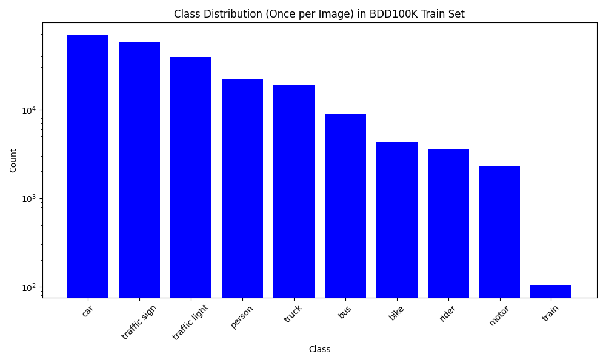
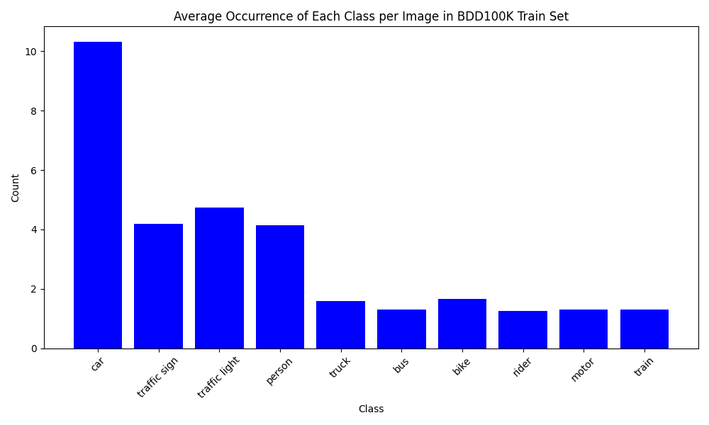
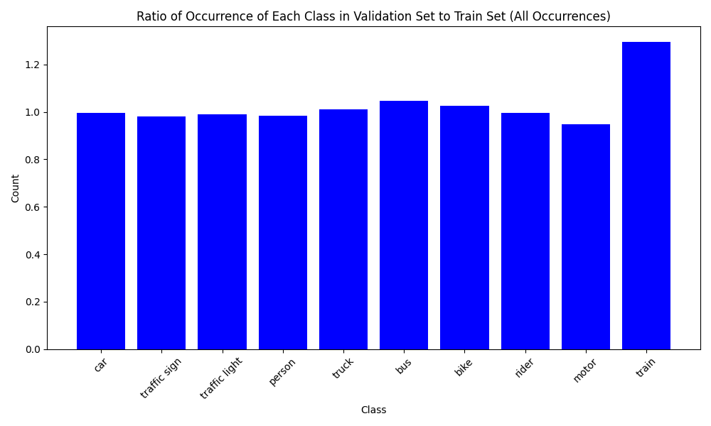
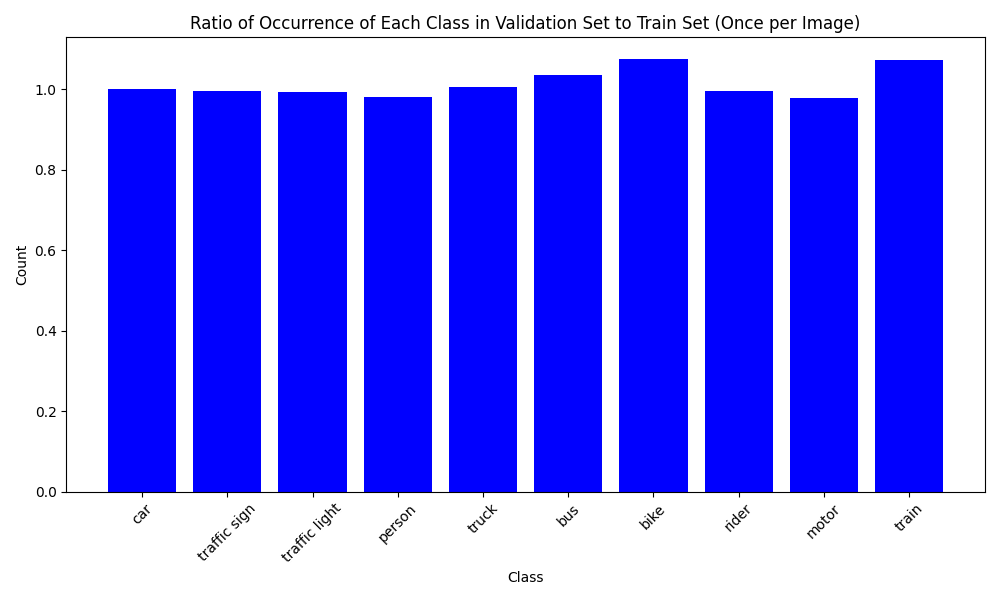
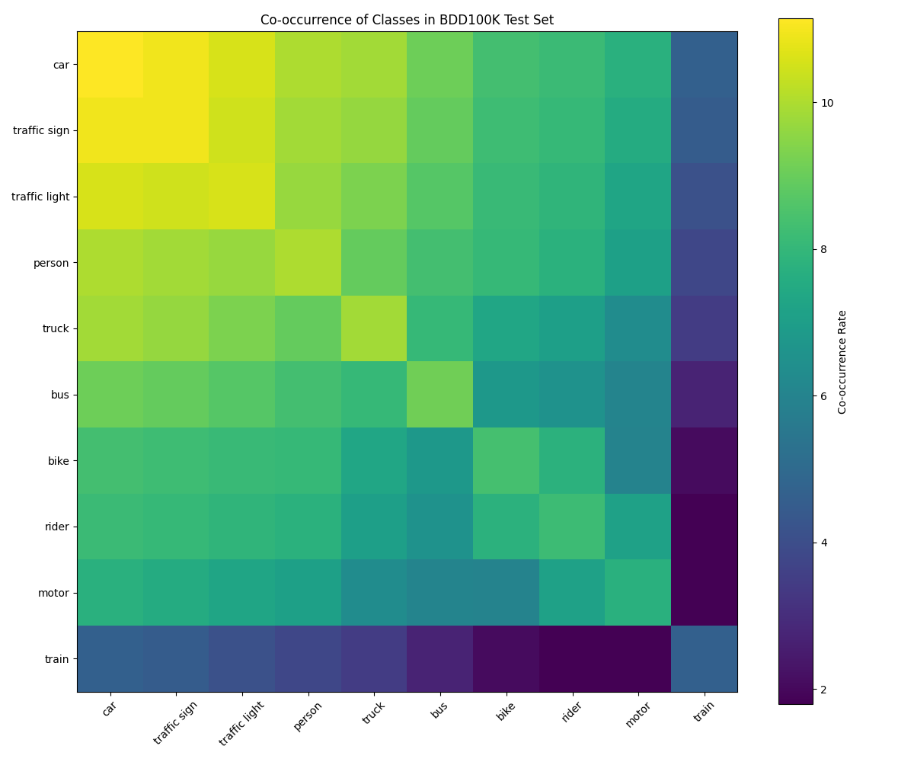

# Task 1: Class Distribution Analysis

Analysis of class distribution in the BDD100K dataset, including occurrence patterns, train-val ratios, and class co-occurrence matrices.


## 🔧 Requirements

```bash
# Required packages
pip install tqdm matplotlib numpy
```

## 📋 Dataset Structure Expected

```
src/
└── task1/
    ├── class_distribution.py
    └── images/          # Output folder for generated plots
data/
└── bdd100k_labels/
    └── 100k/
        ├── train/          # 70,000 JSON files
        │   └── *.json
        └── val/            # 10,000 JSON files
            └── *.json
```

## 🎯 Class Categories

The script analyzes these 10 BDD100K categories (in-order):

1. **car**
2. **traffic sign**
3. **traffic light**
4. **person**
5. **truck**
6. **bus**
7. **bike**
8. **rider**
9. **motor**
10. **train**

---


## 🚀 Quick Start

```bash
# Run the analysis
python3 -m src.task1.class_distribution
```

This will:
- Process 70,000 training images & 10,000 validation images
- Generate 6 visualization plots & save them to `src/task1/images/`

## 📊 Generated Visualizations

### 1. Class Cumulative Presence

Shows how many images contain each class at least once. This represents the "presence" of each class across the dataset.


---

### 2. Class Cumulative Instances

Shows the total count of all object instances across the dataset. Multiple instances per image are counted separately.



---

### 3. Average Occurrences Per Image

Shows the average number of times each class appears in images where it's present.



---

### 4. Train/Test Ratio

Compares the total number of object instances between train and validation sets. Ignore this. From the plots looks like the split is done based on "presence" of classes rather than total instances.



---

### 5. Train/Validation Ratio (Presence)
Compares how many images contain each class between train and test sets.




---

### 6. Class Co-occurrence Matrix

Shows which classes tend to appear together in the same images. Uses log scale for better visualization.



---

