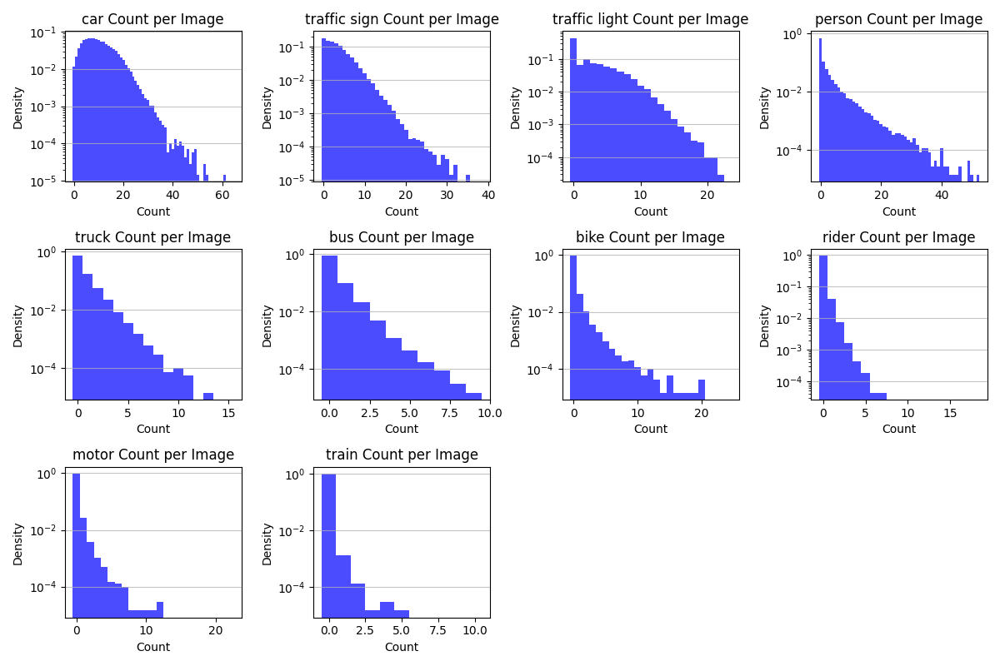
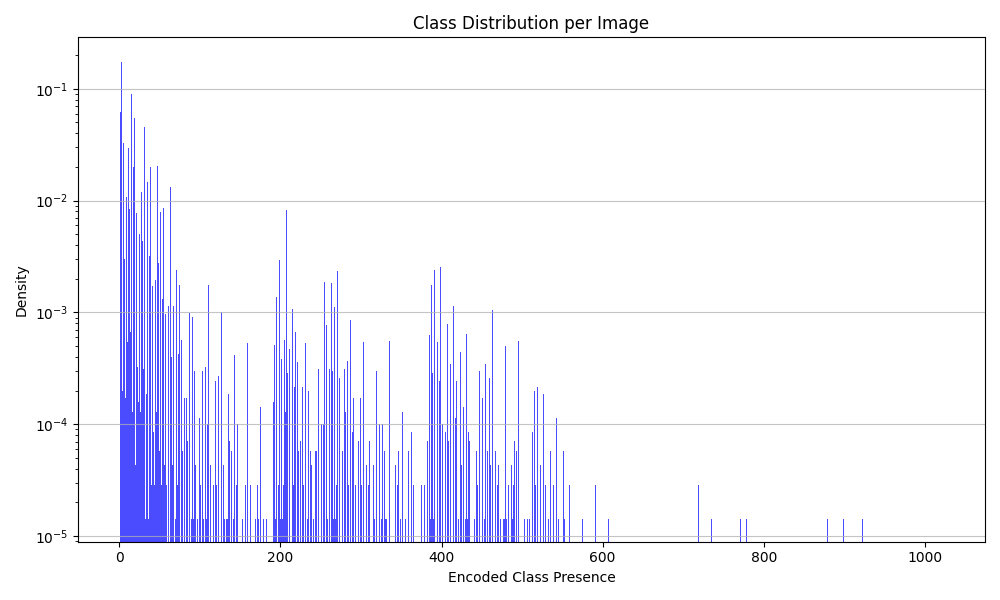
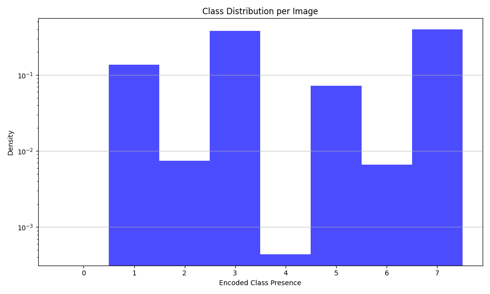
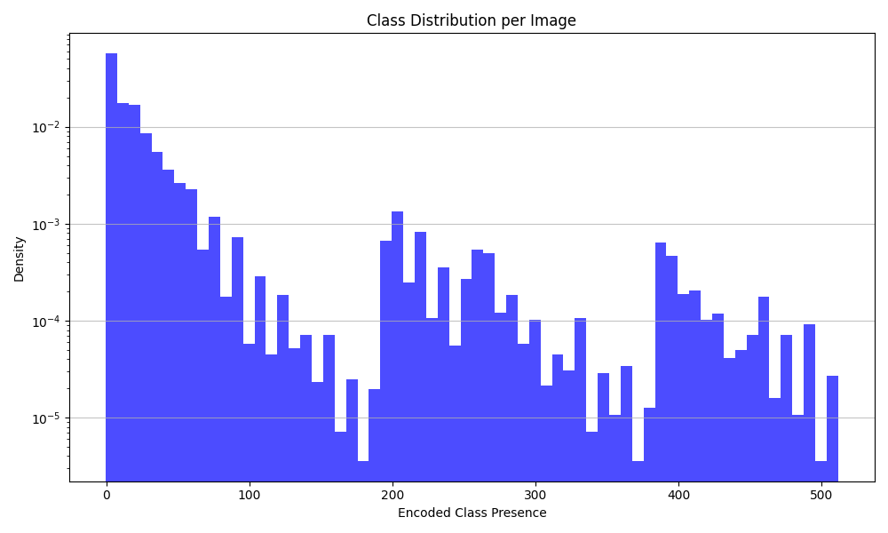
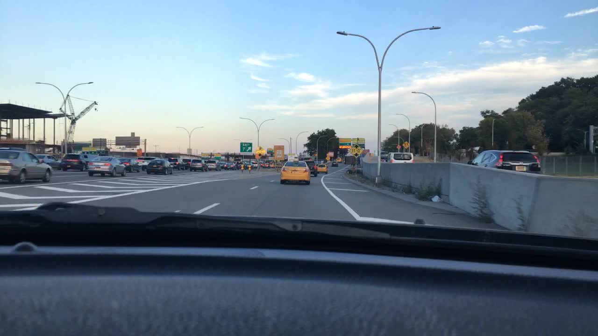

# Task 1: Class Distribution Analysis

Analysis of class distribution in the BDD100K dataset, including occurrence patterns, train-val ratios, and class co-occurrence matrices.


## 🔧 Requirements

```bash
# Required packages
pip install tqdm matplotlib numpy
```

## 📋 Dataset Structure Expected

```
src/
└── task1/
    ├── class_distribution.py
    └── images/          # Output folder for generated plots
data/
└── bdd100k_labels/
    └── 100k/
        ├── train/          # 70,000 JSON files
        │   └── *.json
        └── val/            # 10,000 JSON files
            └── *.json
```

## 🎯 Class Categories

The script analyzes these 10 BDD100K categories (in-order):

1. **car**
2. **traffic sign**
3. **traffic light**
4. **person**
5. **truck**
6. **bus**
7. **bike**
8. **rider**
9. **motor**
10. **train**

---


## 🚀 Quick Start

### Run Class Distribution Analysis

```bash
# Run the main distribution analysis
python3 -m src.task1.class_distribution
```

This will:
- Process 70,000 training images & 10,000 validation images
- Generate 6 visualization plots & save them to `src/task1/images/`

### Run Anomaly Detection & Sample Extraction

```bash
# Run anomaly detection and extract sample images
python3 -m src.task1.anamoly_detection
```

This will:
- Compute class bitmasks for presence-based queries
- Generate class presence distribution plots
- Extract sample images with specific class patterns (e.g., images with 40 cars, 30 signs, etc.)
- Create frequency distribution histograms for all classes

## 📊 Generated Visualizations

### 1. Class Cumulative Presence

Shows how many images contain each class at least once. This represents the "presence" of each class across the dataset.


---

### 2. Class Cumulative Instances

Shows the total count of all object instances across the dataset. Multiple instances per image are counted separately.


---

### 3. Average Occurrences Per Image

Shows the average number of times each class appears in images where it's present.


---

### 4. Train/Test Ratio

Compares the total number of object instances between train and validation sets. Ignore this. From the plots looks like the split is done based on "presence" of classes rather than total instances.


---

### 5. Train/Validation Ratio (Presence)
Compares how many images contain each class between train and test sets.


---

### 6. Class Co-occurrence Matrix

Shows which classes tend to appear together in the same images. Uses log scale for better visualization.


---

## 🔍 Anomaly Detection & Sample Extraction

The `anamoly_detection.py` script provides advanced querying and sample extraction capabilities.

### Generated Analysis

#### All Class Frequency Distribution

Subplots showing instance count distributions for each of the 10 classes:



#### Class Presence Distributions

Multiple histogram plots showing the distribution of class presence patterns:

##### Full Distribution Across All Classes



##### Distribution for Cars, Signs, and Lights Only


`[none, only car, only sign. car&sign, only light, car&light, sign&light, all]`

##### Distribution Excluding Cars, Signs, and Lights



#### Sample Images

Extracted sample images demonstrating specific patterns:

##### Sample: Image with Train


##### Sample: No Cars, Signs, or Lights


##### Image with 40 Cars



##### Image with 30 Traffic Signs


##### Image with 40 Persons


##### Image with 15 Bikes


##### Image with 10 Motorcycles


##### Image with 4 Trains


### Query Examples

```python
# Presence-based query: Find images with trains present
query_bitmask = [0, 0, 0, 0, 0, 0, 0, 0, 0, 1]  # Only train (10th class)
sample_ids = query_presence_sample_id(image_names, class_bitmask, query_bitmask)

# Presence-based query: Find images WITHOUT cars, signs, or lights
query_bitmask = [-1, -1, -1, 0, 0, 0, 0, 0, 0, 0]  # No car, sign, light
sample_ids = query_presence_sample_id(image_names, class_bitmask, query_bitmask)

# Frequency-based query: Find images with exactly 40 cars
sample_ids = query_frequency_sample_id(image_names, instance_counts, query=(0, 40))
```

---

### Action items:
[] Add occulsion and truncation to the mix
[] Add Anomoly detection using the bounding boxes
[] Redo the readme file with more explanation
[] Containerization
[] Add `uv`
[] Explore & add daskboard

---