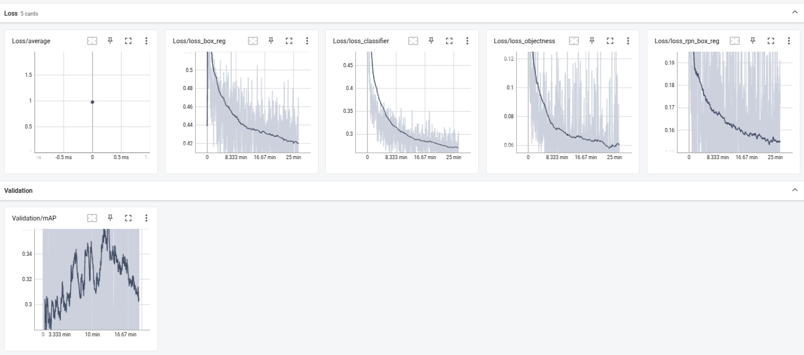

# Task 2 Bonus: PyTorch Faster R-CNN

Pure PyTorch implementation of Faster R-CNN with custom dataset, metrics, and training loop.

## How to Run

```bash
# Train (5 epochs, batch=4, output: ./output/task2b)
python3 -m src.task2_bonus.train
```

**Features:**
- Custom BDDDataset with data augmentation
- Custom metrics (AP/mAP calculation)
- TensorBoard logging
- Mixed precision training (AMP)

---

# Training Logs:



#