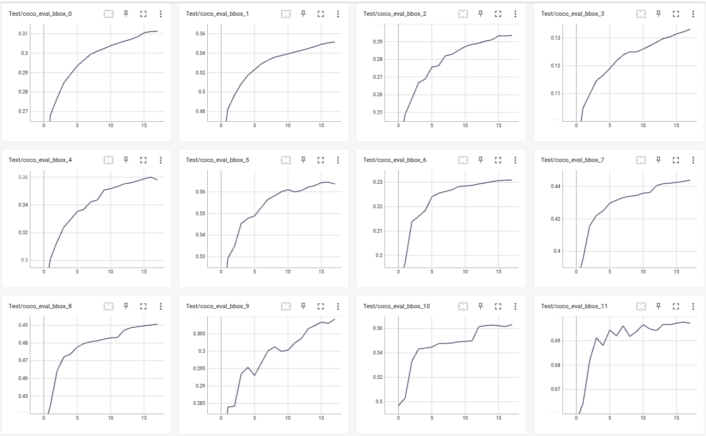
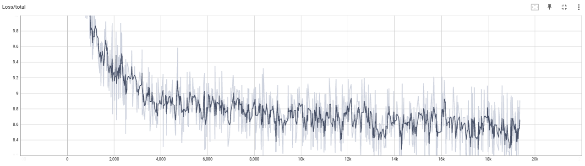
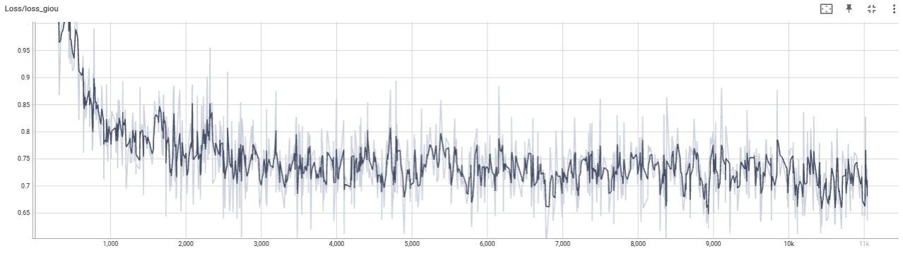
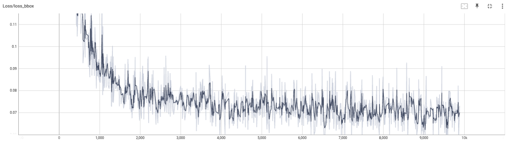
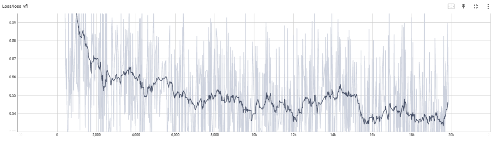

# DETR Training on BDD100K

**Repository:** [RT-DETR](https://github.com/lyuwenyu/RT-DETR/tree/main)
**Model:** RT-DETRv2-S

## Configuration Changes

| Component | Modification |
|-----------|--------------|
| **Dataloader** | Updated data paths; increased batch size to 16 |
| **Optimizer** | Removed LR scheduler |
| **Training** | 30 epochs; reduced learning rate by 25% |

**Run Command:**
```bash
python3 tools/train.py -c <config> -t <model_ckpt>
```

Config files available in `configs/` directory.

---

## Results

**Final mAP: 32.0** (vs. COCO baseline: 48.1)



### Key Findings

- **Small object mAP: 0.141** — primary bottleneck
- **AR gap (AR@1 vs AR@100): 0.231 → 0.495** — reflects ~15 instances/image
- **Small object localization issue:** AR=0.319 vs AP=0.141 (detection works, localization fails)

### Next Steps

- [ ] Increase learning rate and retrain
- [ ] Increase input image resolution (improve small object mAP)
- [ ] Hyperparameter tuning for bbox regression

---

## Training Loss Analysis

### Overall Loss


Loss has not plateaued — model still learning.

### Bounding Box Losses

<table>
<tr>
<td width="50%">

**GIoU Loss**


</td>
<td width="50%">

**Bbox L1 Loss**


</td>
</tr>
</table>

L1 regression loss magnitude comparable to GIoU. Tuning loss weights may improve small object mAP.

### Classification Loss (VFL)


Variational Focal Loss shows noise during training — consider adjusting focal loss parameters.
