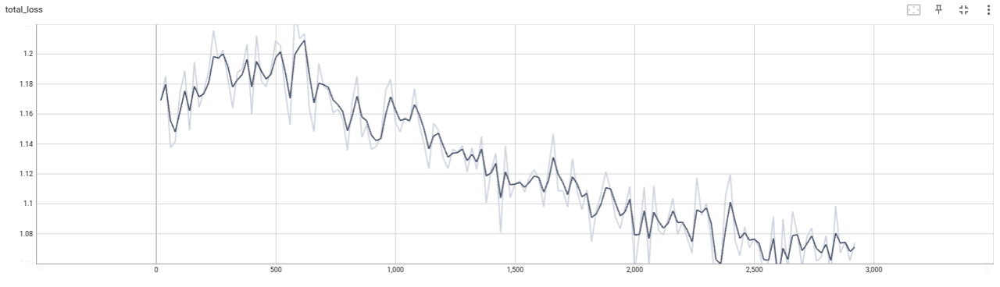
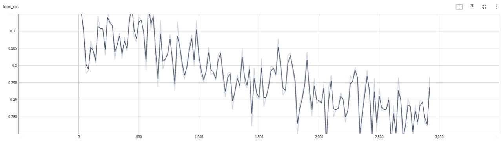
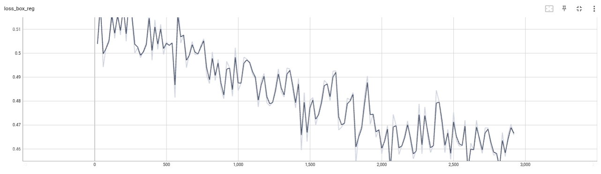
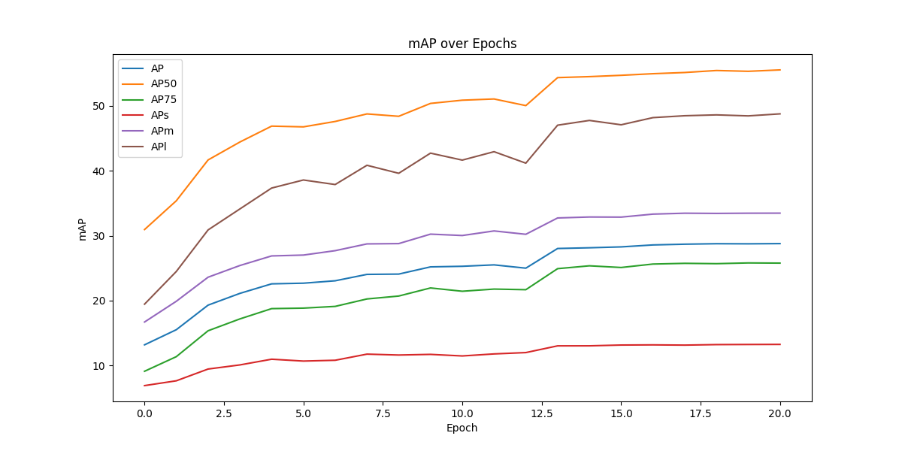
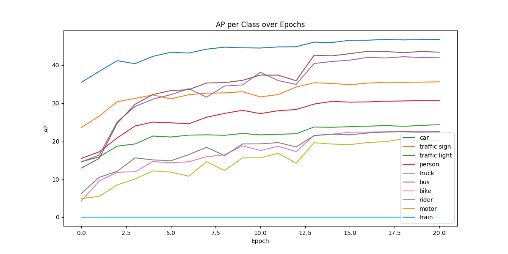
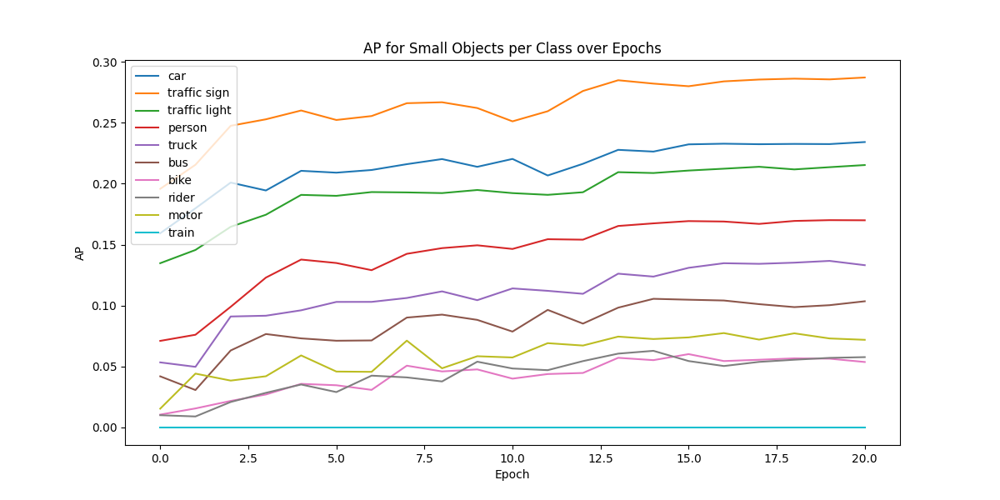
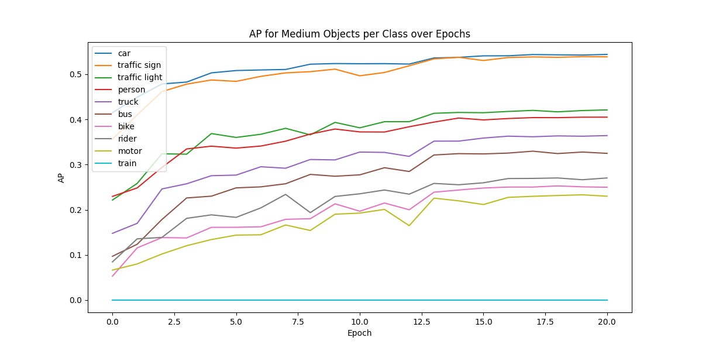
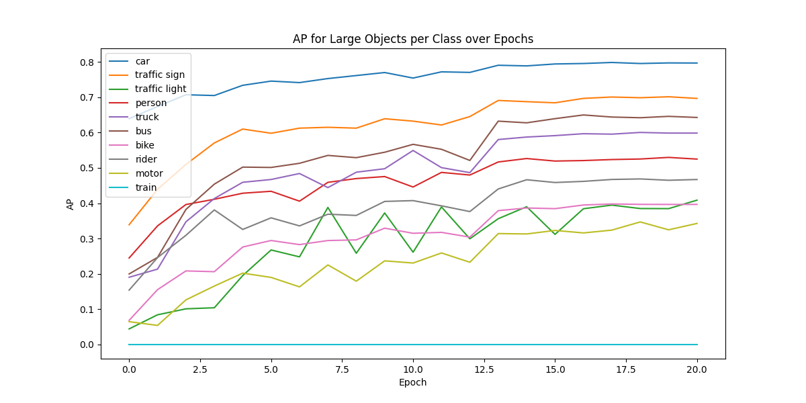
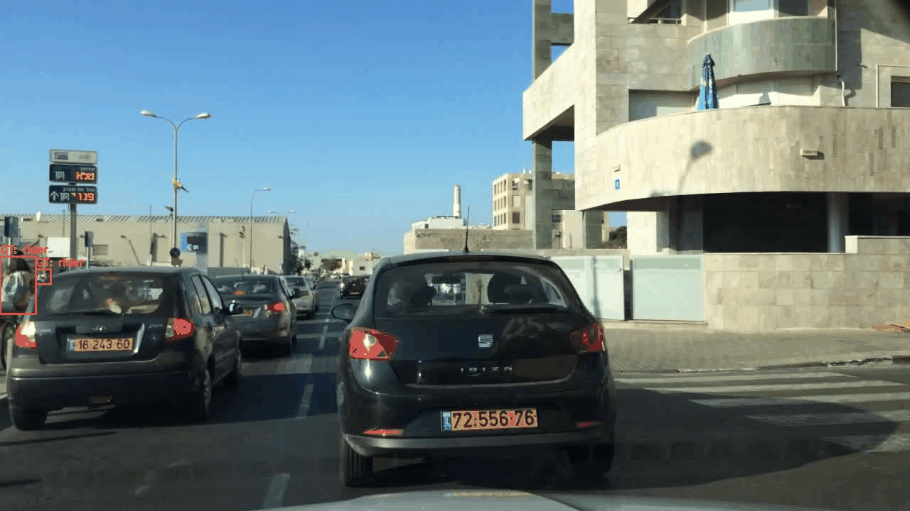

# Faster R-CNN Training on BDD100K

## Training Loss Analysis

<table>
<tr>
<td width="50%">

**Total Loss**

</td>
<td width="50%">

**Classification Loss**

</td>
</tr>
<tr>
<td colspan="2" align="center">

**Regression Loss (Smooth L1)**

</td>
</tr>
</table>

Loss combines cross-entropy classification and Smooth L1 regression, showing convergence throughout training.

---

## Evaluation Results

### mAP Analysis

**Final mAP: 29.0** (vs. COCO baseline: 32.0)

**Key Findings:**
- **mAP_small: 12.0** — primary bottleneck significantly impacting overall performance
- Performance scales with class frequency (class imbalance issue)

### Per-Class Performance

- **Traffic lights:** Poor performance despite high frequency
- **Truck & Bus:** Performing well (~1/5th traffic light frequency)
- **Other classes:** Performance correlates with frequency

### Object Size Breakdown

<table>
<tr>
<td width="33%">

**Small**

</td>
<td width="33%">

**Medium**

</td>
<td width="33%">

**Large**

</td>
</tr>
</table>

- **Small:** Traffic signs excel (rectangular, unoccluded); traffic lights perform well but high frequency lowers class mAP
- **Medium/Large:** Performance scales with object frequency; trucks/buses dominate large objects

---

## Training Improvements

- [ ] Use **Focal Loss** or class-weighted cross-entropy (address class imbalance)
- [ ] Increase image resolution, learning rate, and training duration
- [ ] Upgrade backbone (ConvNeXt/Swin Transformer) or use newer architecture
- [x] Used Detectron2 (10x faster than custom implementation)

---

## Qualitative Analysis

> **Note:** GIFs auto-play and loop continuously (no pause available in markdown). Use browser controls to pause if needed.

### Improved Detection

<table>
<tr>
<td width="33%">

**Traffic Lights**

</td>
<td width="33%">

**Bicycles**

</td>
<td width="33%">

**Motorcycles**

</td>
</tr>
</table>

### Multi-Object Detection

<table>
<tr>
<td width="33%">

**20 Cars**

</td>
<td width="33%">

**Cars in Traffic**

</td>
<td width="33%">

**Car + Sign + Light**

</td>
</tr>
</table>

### Reduced False Positives

<table>
<tr>
<td width="50%">

**Person Detection**

</td>
<td width="50%">

**Traffic Signs**

</td>
</tr>
</table>

### No Significant Change

<table>
<tr>
<td width="50%">

**Train Detection**

</td>
<td width="50%">

**Rider Detection**

</td>
</tr>
</table>
